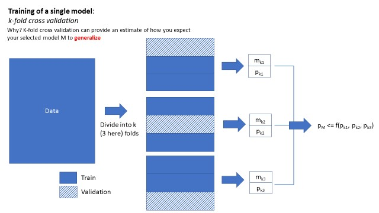
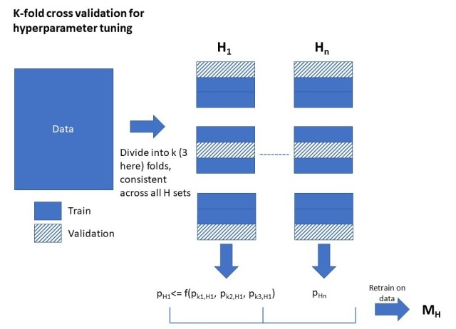
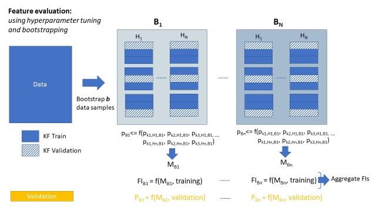
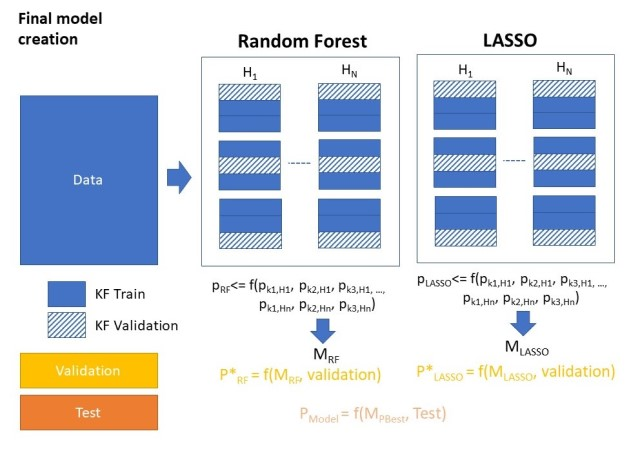

```{r echo=FALSE}
library(knitr)
```
# Predicting the diseases of despair

## Overview
The purpose of this project is to predict diseases of despair using machine learning (ML) models.  The ML models that we've selected are random forests and LASSO.  They were chosen based on their interpretability in terms of the relation between predictors (features) and response variables (outcomes).  They were also chosen for their widespread usage and well-known behavior.  This work can be segmented into two separate steps: evaluation of predictive features and generation of the final model.  The following sections detail this approach.

## ML Methods
### Splitting the data
In this work, we utilize traditional machine learning approaches to creating models which provide reliable performance on data which it has never seen (generalization).  We first divide the data into three sections: training, validation, and testing.  The training set is used exclusively for training, and the validation set is used to independently assess generalization to an external dataset choose between trained models.  The final holdout test set is used for evaluation of the selected model.

- **Question.**  Why do we need an external validation set?  Why not simply divide the data into training and testing?
  - This is because the validation set is used for selecting between different models.  The set of models from which a final selection should be made can be considered to be a hyperparameter, and thus the validation set is then used for tuning this hyperparameter.  This renders the validation set an optimistic view on the expected performance of the dataset on unseen data.
  
- **Question.**  Aren't the Out-of-Bag (OOB) samples of a random forest sufficient in determining the performance of a RF?
  - OOB samples tend to be a bit optimistic about the performance of the model, and they are evaluated slightly differently as compared to how these samples would we be assessed if they were an independent dataset.  Furthermore, they way they are generated presents challenges in terms of using the same data to assess other models (e.g., LASSO).

### K-fold cross validation and hyperparameter tuning
When we train models, we use k-fold cross-validation with hyperparameter tuning.  A diagram of this is shown below.  The dataset refers to whichever data is being utilized to generate the model (e.g., bootstrap data, training data, etc.).  Figure 1 below shows k-fold cross validation.  The data is divided into k folds, with k-1 folds used for training the model and the kth fold used for testing.  This repeats k times until each fold has been used for evaluation.  The folds are held constant through training each model; i.e., if desired, the performance on each individual fold may be compared.

```{r echo=FALSE, out.width='50%'}

```

- **Question.** Why k-fold cross-validation?
  - This gives us a sense of how the model will generalize.  We can combined the performance on each of the k evaluation folds, which provides an assessment of how the model performs in general.
- **Question.** Why not bootstrap resampling, repeated k-fold, or other types of resampling?
  - We could certainly do any of these things.  K-fold cross validation is currently the favored approach in machine learning since it's really the generalization we care about, particularly in comparison to other models.  It'd be interesting future work to explore how and if these approaches would significantly influence the results of this work.

### Hyperparameter tuning
Figure 2 below demonstrates the usage of k-fold cross validation with hyperparameter tuning.  Hyperparameter tuning is useful for generating models with more performance based on parameters which guide their behavior.  For example, in random forests, parameters governing the maximum depth of the component trees or the total allowable number of trees in the forest are hyperparameters.  When we combine hyperparameter tuning with k-fold cross validation, we can consider this as training several different models, differing only in their hyperparameters.  We can evaluate, compare, and select models based on this comparison.

```{r echo=FALSE, out.width='50%'}

```

### Predictive Feature Evaluation
In this stage, we evaluate the predictors that most strongly contribute to predicting the diseases of despair, and the approach is shown in Figure 3.  For the selected data (e.g., the training data), b bootstrap samples are resampled from this data.  For each of the b bootstrap samples, the procedures defined above - hyperparameter tuning with k-fold cross validation are utilized.  This generates a slightly different derived dataset upon which to evaluate the most important features, and their rankings and consistency among the bootstrap samples.

```{r echo=FALSE, out.width='50%'}

```
- **Question.** Why didn't we do some type of recursive feature elimination (RFE) or selection algorithm to find the best features?
  - Our major interest in this work is truly the features - finding the most important ones and then comparing them across several modalities.  Our approach is based on bootstrapping, which gives us a good sense of stability in terms of the features generated.  Furthermore, we're less interested in reducing the total set of features and more interested in how the ordering of total set of features relates to the ordering of another set based on differences in models and outcomes.

### Final Model
In this final stage, we generate our final model based on all of the features in the original dataset, regardless of feature importance.  This allows us to compare the results across a number of models and outcomes.  The training and evaluation of this final model proceeds according to hyperparameter tuning with k-fold cross validation described above.  At the end of this training, we use the validation set to _select the best model for RF and LASSO_.  We test these best models on the test set.

```{r echo=FALSE, out.width='50%'}

```
The figure above depicts a stage-like selection of the best model for a method using k-fold cross validation, and then evaluating these best two on the validation set.  A second configuration could skip the selection based on k-fold cross validation and instead evaluate every hyperparameter configuration on the validation set.  Regardless, at this stage, the best RF model and LASSO model will be tested on the test set.

- **Question.**  If you go with the second configuration, why do you even need k-fold cross validation?
  - We use k-fold cross validation for understanding generalization, but also the kth held-out fold is used for early stopping in hyperparameter tuning.  The folds here can be used in the same way.  However, in this scenario, a better use of the validation frame may be as using it as the early stopping criteria.  This may be implemented in the future.

- **Question.**  What?  ML models should be selected with the model type as a hyperparameter.  So, instead of ending up with two models to evaluate on the test set, you should only end up with one.
  - True.  However, the purpose of this work is not to find the best model overall (although we can easily modify this), but to compare the most important features as calculated by these two different models (and outcomes).  The hypothesis is - if some feature is truly important, the numerical method used to arrive at those features should not be as important.  We thusly compare the importance of the features across different models.
  
- **Question.** Didn't you already use the validation set in the feature evaluation step?  This would make your expected performance on the validation step optimistic.
  - The way that we use the validation set during feature evaluation is to merely provide an external evaluation about the performance of our model.  This is largely unneeded and could be removed; we could easily use the performance from k-fold cross validation to justify the usage of these bootstrap models.  We simply choose to utilize the external validation set to look at the performance of the full bootstrap model (i.e., in contrast to the k-fold models), but it has no influence on future steps.
  - Even if we had used the validation set for some sort of selection during the Feature Evaluation phase, it is likely that _all_ of the resulting model performances would be optimistic.  We would be picking the best performing model out of a set of optimistic models.

## Resources
[1] M Kuhn and K Johnson.  Feature Engineering and Selection: A Practical Approach for Predictive Models, 2019.  [Available online](http://www.feat.engineering/)  
[2] I Tsamardinos and E Greasidou and G. Borboudakis.  Bootstrapping the out-of-sample predictions for efficient and accurate cross-validation.  [Available online](https://link.springer.com/article/10.1007/s10994-018-5714-4)  
[3] B Gregorutti and B Michael and P Saint-Pierre.  Correlation and variable importance in random forests.  Statistics and Computing, 2017.  [Available online](https://link.springer.com/article/10.1007/s11222-016-9646-1)  
  