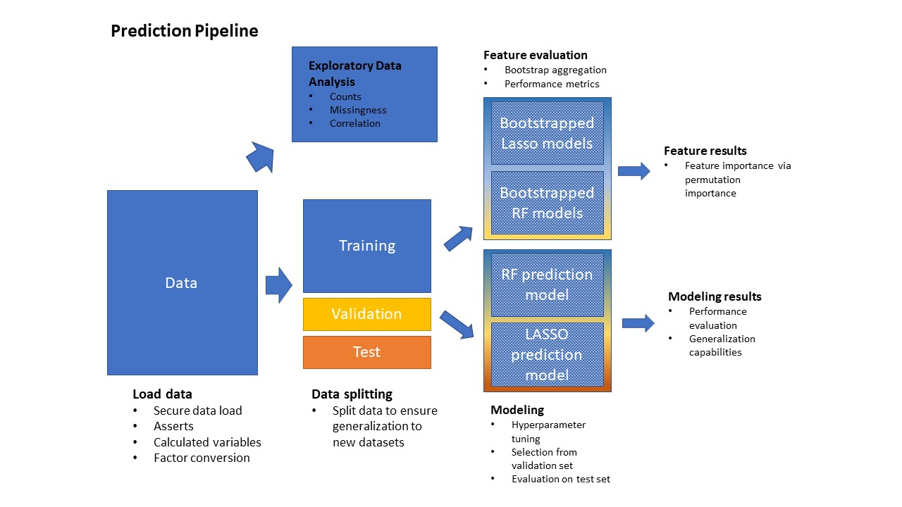

```{r source files}
source("function_import.R")
```


```{r setup, include=FALSE}
knitr::opts_chunk$set(echo = TRUE)
```

**Purpose.** In this work, we will explore the relation between identified measures of despair of interest (e.g., personality measures of self-consciousness, individual and composite item scores from the CES-D assessment) and descriptors of diseases of despair.  We will achieve this goal through modeling the outcomes based on the included predictors, and robustly assess the importance of the included features in predicting the outcomes via bootstrapping.  We will use two well-known machine learning models, random forests and LASSO, which are both frequently used to measure the relative importance of the predictors included in the models.  Lastly, we'll generate trained and tuned models using this reduced feature set which can be used by others wish to predict the identified outcomes.

**Subject inclusion.** For this investigation, we will omit the entirety of Wave 2.  This is commonly done in analyses of AddHealth data due the design of the original study.  Otherwise, our dataset will include only subjects who have predictor and outcome data in _all_ of the waves.

**Outcome variables.** In this experiment, we assess _prescription drug use_ at Wave 5.  

**Predictor variables.** The predictors for these models are hand-picked, and based on previous work, relevance, and subject matter expertise. The set of predictors and the set of outcomes are disjoint.  Predictors from Waves 1-4 (excluding Wave 2, see above) are included, and will be detailed in the following analysis.

```{r load libraries, include=FALSE}
# Use pacman, which forces an install if the library isn't present on the running machine
if (!require("pacman")) install.packages("pacman")
pacman::p_install(plotly)
pacman::p_load(tidyverse, janitor, rsample, h2o, furrr, rcompanion, ggcorrplot)

```

```{r initializations, include=FALSE}
h2o.init() 
h2o.no_progress()
future::plan(multiprocess)
```

```{r seeds for reproducibility}
seed= 3895
set.seed(seed)
```
# Pipeline overview
```{r echo=FALSE, out.width='50%'}

```
# Dataset generation

The predictors we will be using will be the the variable `predictor_list` loaded from `10-import-data.Rmd` file. These initial set of predictors will be based of the list of variables that describe:
1. anxiety
2. depression 
3. optimism 

```{r, include=FALSE}
## set outcome variable of interest
outcome = 'p_drug' # This is the binary variable representing prescription drug use at wave 5

wave_data <- load_waves(1:5, filebase='Z:')
full_dataset <- get_working_dataset_full(wave_data, join_type = 'full')
```

```{r, warning=FALSE,message=FALSE}
## get the aids that you want
inner_aids <- get_inner(list(wave_data[[1]], wave_data[[3]], wave_data[[4]], wave_data[[5]]))

## use the features and ids that you want to select out what you want
pr_drug_ds <- full_dataset %>%
  add_pres_drug %>%
  add_demographics() %>%
  dplyr::select(aid, predictor_list, demographic_age_list, demographic_list, outcome) %>%
  filter(aid %in% inner_aids) %>%
  remove_subjects_not_in_wave1(filebase='Z:') %>%
  mutate_at(vars(-starts_with("age_")), as_factor) %>%
  drop_na(outcome)


# Report about the characteristics of the subjects left out of the join
count_not_joined(wave_data = wave_data, number_waves_joined = 5)

# Validate the generated dataset using asserts

```

# Data exploration and visualization
Here, we comment about the general characteristics of the data based on the provided visualizations.  We comment on missingness of data, any strange or unusual behavior (e.g., strong imbalances), and any correlation that sticks out.
```{r eda}
# Visualize distributions of variables of interest
pr_drug_ds %>% 
  dplyr::select(-aid) %>%
  graph_bar_discrete(df = .,
                   plot_title = "Distributions of Discrete Variables",
                   max_categories = 50,
                   num_rows = 3,
                   num_cols = 3,
                   x_axis_size = 12,
                   y_axis_size = 12,
                   title_size = 15)

# Visualize missingness
graph_missing(pr_drug_ds, 
              only_missing = TRUE,
              title = "Percent Missing",
              box_line_size = .5,
              label_size = .5,
              x_axis_size = 12,
              y_axis_size = 12,
              title_size = 15)

# Visualize correlation among first 20 predictors
pr_drug_ds %>%
  dplyr::select(1:20) %>%
  pairwise_cramers_v() %>%
  plot_cramer_v(x_axis_angle = 90,
                plot_title = "Association among Categorical Variables",
                interactive = TRUE)
```

# Machine learning split of the data

In this section, we split the data to ensure that our model is able to generalize to other datasets.
```{r, message=FALSE, warning=FALSE}
## split the data into relevant proportions desired
data_splits <- pr_drug_ds %>%
  split_data(strat_var = outcome, ratios=c(0.7, 0.2, 0.1))

# assemble list
training_df <- data_splits$train
validation_df <- data_splits$valid
testing_df <- data_splits$test
```

# Robust feature evaluation {.tabset .tabset-fade .tabset-pills}
- Here, we will justify the feature selection based on performance metrics; we assert that because of good model performance, we can expect that the features selected are reasonable because the models fit the data well (without being overtrained)
- Here, the subject matter experts will comment on the selected features and their general applicability to the outcomes of interest.
- Lastly, we will comment on differences in results between RF and LASSO

## RF model
The RF models are chosen based on a grid search using the following the parameters: 

  - max depth: maximum depth allowed for a single tree in the RF  
  - number of trees: maximum number of trees allowed in the RF  
  - mtries: the number of columns sampled for each tree split  
  - min_rows: the minimum number of rows required to split the internal node
  - balance classes: whether to balance the classes or not
  - stopping_metric: metric which results in early stopping of training of the model
  - categorical encoding: use one hot encoding to create straightforward comparison with LASSO

```{r feature selection rf, include=FALSE}

# Spans of hyper parameters for random forest
rf_params <- list(max_depth = 50,
                  ntrees = 150,
                  mtries = seq(-1, 20, by=10),
                  min_rows = seq(20, 60, by=20),
                  balance_classes = c(TRUE, FALSE),
                  stopping_metric = 'AUCPR',
                  categorical_encoding = 'one_hot_explicit')

# rf_params <- list(max_depth = c(20, 50),
#                   balance_classes = TRUE,
#                   categorical_encoding= 'one_hot_explicit')

# define number of bootstraps
n_boot = 2

pr_drug_rf <- model_feature_selection("RF",training_frame = training_df,
                      validation_frame = validation_df,
                      hyper_params = rf_params,
                      outcome = outcome, n = n_boot, seed=seed)

```

The following table displays the mean performance metrics for the bootstrapped models on the validation set, removing values for which there are NA.

```{r evaluate bootstrap model performance rf, warning=FALSE, message=FALSE}
mean_bs_rf_perf <- get_metric_set_from_perfs(pr_drug_rf$perfs) %>%
  dplyr::select(accuracy, mpce, sens, spec, ppv, npv, roc_auc, pr_auc,
         tns, tps, fns, fps, no_n, no_p,  err_rate, bal_accuracy, everything()) %>%
  summarise_if(is.numeric, mean, na.rm=TRUE) %>%
  mutate(model = 'bs_rf') %>%
  dplyr::select(model, everything())

mean_bs_rf_perf
```
As shown, the bootstrapped models tend to have high specificity but low sensitivity, indicating that there is a challenge in identifying subjects with suicidal ideation.

### Feature importances: Random Forest
#### Mean decrease in impurity (MDI)
```{r}
boot_rf_mdi <- pr_drug_rf$mdi %>%
  get_median_placement(use_base_var = TRUE) %>%
  add_attribute_names('predictor', full_dataset) %>%
  dplyr::select(predictor, att_name, overall_rank)

head(boot_rf_mdi, 20)
```
This table returns the MDI variable importance ranks that returned from each of the bootstrapped models.

```{r fig.width = 10, fig.height = 12}
# Needs to be fixed so that axes don't overlap each other and obscure understanding
plot_placement_boxplot(pr_drug_rf$mdi)
```

#### Permutation importance
Now, let's look at the permutation importance:

```{r get rf permutation importance, warning=FALSE, message=FALSE}
boot_rf_perm_plt <- pr_drug_rf$models %>%
  get_aggregated_permute_imp(training_df, outcome=outcome)
```

```{r aggregate rf perm results}
met <- 'pr_auc'
boot_rf_perm <- boot_rf_perm_plt %>%
  get_permute_placement(metric_oi=met) %>%
  add_attribute_names('predictor', full_dataset) %>%
  dplyr::select(predictor, everything())

head(boot_rf_perm, 20)
```

#### MDI vs Permutation importance
In this step, we assess the differences generated between the different types of importances.
```{r fig.width = 16, fig.height = 14}
cbind(boot_rf_mdi[1:20,], dplyr::select(boot_rf_perm[1:20,], -all_of(met)))
```
As shown, the MDI importance suffers from imbalances due to the number of values associated with a predictor.  Because the wave ages have so many more values than the other factors, this artificially inflates their importance in MDI.  The permutation importance is more intuitive.

```{r fig.width = 10, fig.height = 12}
plot_permute_var_imp(boot_rf_perm, metric = pr_auc)
```


## LASSO model
In this step, we model the relation between the outcomes and the predictors using a linear regression with L2 regularization.  This drives the importance of unimportant and redudant features towards zero.

```{r feature selection lasso, message=FALSE, warning=FALSE}
# Function parameters
lasso_params <- list(alpha = c(1))
# Call modeling function using function parameters and show visualization of results.  Recommend the number of features that should be used.  Report performance metric stats.

pr_drug_lasso <- model_feature_selection( "Lasso",
                                          training_frame = training_df,
                                          validation_frame = validation_df,
                                          hyper_params = lasso_params,
                                          outcome = outcome, 
                                          n = n_boot)
```

```{r evaluate bootstrap model performance lasso, warning=FALSE, message=FALSE}
mean_bs_lasso_perf <- get_metric_set_from_perfs(pr_drug_lasso$perfs) %>%
  dplyr::select(accuracy, mpce, sens, spec, ppv, npv, roc_auc, pr_auc,
         tns, tps, fns, fps, no_n, no_p,  err_rate, bal_accuracy, everything()) %>%
  summarise_if(is.numeric, mean, na.rm=TRUE) %>% 
  mutate(model='bs_lasso') %>%
  dplyr::select(model, everything())

mean_bs_lasso_perf
```

### Feature importances: LASSO
#### Coefficient-based variable importance
```{r}
boot_lasso_mdi <- pr_drug_lasso$mdi %>%
  get_median_placement(use_base_var = TRUE) %>%
  add_attribute_names('predictor', full_dataset) %>%
  dplyr::select(predictor, att_name, overall_rank)

head(boot_lasso_mdi, 20)
```

```{r fig.width = 10, fig.height = 12}
plot_placement_boxplot(pr_drug_lasso$mdi)
```

#### Permutation importance
```{r message=FALSE, warning=FALSE}
boot_lasso_perm_plt <- pr_drug_lasso$models %>%
  get_aggregated_permute_imp(training_df, outcome=outcome)
```

```{r aggregate lasso permutations and get metrics}
boot_lasso_perm <- boot_lasso_perm_plt %>%
  get_permute_placement(metric_oi=met) %>% #set in random forest section
  add_attribute_names('predictor', full_dataset) %>%
  dplyr::select(predictor, everything())

head(boot_lasso_perm, 20)
```

```{r plot lasso permutation, fig.width = 10, fig.height = 12}
plot_permute_var_imp(boot_lasso_perm, metric = pr_auc)
```

#### Coefficient vs. Permutation importance
Now, we compare the feature importances generated by the two different approaches.  The traditional method of evaluating feature importance for regression methods is through analysis of the coefficients.
```{r fig.width = 16, fig.height = 14}
cbind(boot_lasso_mdi[1:20,], dplyr::select(boot_lasso_perm[1:20,], -met))
```

## Comparison: Model Type Mean Performance
The following table compares the mean performance of bootstrapped random forests to the mean performance of bootstrapped LASSO methods.
```{r}
bs_comp_perfs <- rbind(mean_bs_rf_perf, mean_bs_lasso_perf) 
bs_comp_perfs
```

## Comparison: Model Type Feature Importance
Here, we look at the aggregated results of the bootstrapped predictors and compare the models generated to each other.
```{r}
joined_results <- boot_rf_perm %>%
  dplyr::select(-met) %>%
  full_join(dplyr::select(boot_lasso_perm, -met), by=c("predictor", "att_name"), suffix=c('.rf', '.lasso')) %>%
  mutate(mean_rank = (overall_rank.rf+overall_rank.lasso)/2) %>%
  arrange(mean_rank)

head(joined_results, 20)
```

The following visualization provides the intuition about the differences in the rankings between model types.  They're ordered by the overall mean importance, and for a given variable, the differences in rank are shown.
```{r fig.width = 16, fig.height = 14}
# Comparison of top_n features
joined_results %>%
  compare_feature_select(interactive = TRUE,
                         top_n = 100,
                         opacity = 0.50,
                         plot_title = "Permutation Importance of Predictors by Model")
```


# Generation of final model {.tabset .tabset-fade .tabset-pills}

## RF model
In this step, we build the final model for the random forest.  We use slightly more values in order to come up with the best model, keeping in mind the number of combinations that are required to run to evaluate the grid.
```{r final model evaluation rf}

# # Spans of hyper parameters for random forest
rf_params <- list(max_depth = 50,
                  ntrees = 150,
                  mtries = seq(-1, 30, by=5),
                  min_rows = seq(5, 60, by=5),
                  balance_classes = c(TRUE, FALSE),
                  stopping_metric = 'AUCPR',
                  categorical_encoding = 'one_hot_explicit')

# rf_params <- list(max_depth = seq(20, 50, 20),
#                   balance_classes = TRUE,
#                   categorical_encoding= 'one_hot_explicit')

# Function parameters
final_model_rf <- rf_model(outcome,
                           training_frame = training_df,
                           validation_frame = validation_df,
                           nfolds = 5,
                           hyper_params = rf_params, model_seed=seed)

```

### Performance
The final random forest performance metrics are shown below:
```{r}
# show model final performance
print(final_model_rf[[2]])
```

### Features: permutation importance
```{r get plottable permutation importance, message=FALSE, warning=FALSE}
final_rf_perm_plt <- c(final_model_rf[[1]]) %>%
  get_aggregated_permute_imp(training_df, outcome=outcome)
```

```{r get metrics for final rf}
final_rf_perm <- final_rf_perm_plt %>%
  get_permute_placement(metric_oi=met) %>%
  add_attribute_names('predictor', full_dataset) %>%
  dplyr::select(predictor, everything())

head(final_rf_perm, 20)
```

```{r plot rf final permutation, fig.width = 10, fig.height = 12}
plot_permute_var_imp(final_rf_perm, metric = pr_auc)
```
### Comparison with bootstrap results
This section investigates the differences in the bootstrap results vs the features generated from the random forest final model.  The following table shows the overall differences in rank.

```{r}
rf_joined_results <- final_rf_perm %>%
  dplyr::select(-met) %>%
  full_join(dplyr::select(boot_rf_perm, -met), by=c("predictor", "att_name"), suffix=c('.final', '.bootstrap')) %>%
  mutate(mean_rank = (overall_rank.final + overall_rank.bootstrap)/2) %>%
  arrange(mean_rank)

head(rf_joined_results, 20)
```

The following plot provides visualizations for the difference in the final model rankings vs the bootstrap.

```{r fig.height=14, fig.width=16}
# Comparison of top_n features
rf_joined_results %>%
  compare_feature_select(sel_cols = c("overall_rank.final", "overall_rank.bootstrap"),
    interactive = TRUE,
    top_n = 100,
    opacity = 0.50,
    plot_title = "Permutation Importance of Predictors: Final vs. Bootstrap")
```

## LASSO model
Now, we create the final model for LASSO.  There is no substantial difference between this method and the bootstrap methods, other than the data upon which the model is being built.
```{r final model evaluation lasso, message=FALSE, warning=FALSE}
# Function parameters
lasso_params <- list(alpha = c(1))

final_model_lasso <- lasso_model(training_frame = training_df,
                                 validation_frame = validation_df,
                                 outcome = outcome,
                                 nfolds = 5,
                                 hyper_params = lasso_params)
```

The final LASSO performance metrics are shown below:
```{r}
# show model final performance
print(final_model_lasso[[2]])
```

### Features: permutation importance
```{r get plottable permutation importance lasso, message=FALSE, warning=FALSE}
final_lasso_perm_plt <- c(final_model_lasso[[1]]) %>%
  get_aggregated_permute_imp(training_df, outcome=outcome)
```

```{r get permute features for final lasso}
final_lasso_perm <- final_lasso_perm_plt %>%
  get_permute_placement(metric_oi=met) %>%
  add_attribute_names('predictor', full_dataset) %>%
  dplyr::select(predictor, everything())

head(final_lasso_perm, 20)
```

```{r plot lasso final permutation, fig.width = 10, fig.height = 12}
plot_permute_var_imp(final_lasso_perm, metric = pr_auc)
```
### Comparison with bootstrap results
This section investigates the differences in the bootstrap results vs the features generated from the LASSO final model.  The following table shows the overall differences in rank.

```{r}
lasso_joined_results <- final_lasso_perm %>%
  dplyr::select(-met) %>%
  full_join(dplyr::select(boot_lasso_perm, -met), by=c("predictor", "att_name"), suffix=c('.final', '.bootstrap')) %>%
  mutate(mean_rank = (overall_rank.final + overall_rank.bootstrap)/2) %>%
  arrange(mean_rank)

head(lasso_joined_results, 20)
```

The following plot provides visualizations for the difference in the final model rankings vs the bootstrap.

```{r fig.width = 16, fig.height = 14}
# Comparison of top_n features
lasso_joined_results %>%
  compare_feature_select(sel_cols = c("overall_rank.final", "overall_rank.bootstrap"),
    interactive = TRUE,
    top_n = 100,
    opacity = 0.50,
    plot_title = "Permutation Importance of Predictors: Final vs. Bootstrap")
```

## Comparison: Final model features
Here, we compare the features generated by the permutation importance between the two final models.

```{r}
rf_lasso_final_joined_results <- final_rf_perm %>%
  dplyr::select(-met) %>%
  full_join(dplyr::select(final_lasso_perm, -met), by=c("predictor", "att_name"), suffix=c('.rf', '.lasso')) %>%
  mutate(mean_rank = (overall_rank.rf+overall_rank.lasso)/2) %>%
  arrange(mean_rank)

head(rf_lasso_final_joined_results, 20)
```

The following visualization provides the intuition about the differences in the rankings between the final model types.  They're ordered by the overall mean importance, and for a given variable, the differences in rank are shown.

```{r fig.width = 16, fig.height = 14}
# Comparison of top_n features
rf_lasso_final_joined_results %>%
  compare_feature_select(sel_cols = c("overall_rank.rf", "overall_rank.lasso"),
    interactive = TRUE,
    top_n = 100,
    opacity = 0.50,
    plot_title = "Permutation Importance of Predictors: Random Forest vs Lasso")
```

## Comparison: Final model performance
With the final models generated, we're now able to compare their performance metrics.
```{r final model comparison, fig.width = 10, fig.height = 12}
# Comparison of performance metrics
valid_perf <- get_metric_set_from_perfs(perf_list = list(final_model_rf[[2]], final_model_lasso[[2]])) %>%
  mutate(model = c('rf', 'lasso'))

testing_perf <- get_metric_set_from_models(testing_df, list(final_model_rf[[1]], final_model_lasso[[1]]), out=outcome) %>%
  mutate(model = c('rf', 'lasso'))
```

**Validation and selection.**
The following table shows the comparison between models in terms of the validation set.  We can select our final model based on the best performing model according to the metric.
```{r}
print(valid_perf)
```

**Testing performance.**
The following shows the performance of both the models on the test set.  Note that although we don't use this test set to evaluate the final models, we can still see how our selected method would have performed.
```{r}
print(testing_perf)
```

The following plots show a comparison between the performance of the models on the validation and test sets.  Again, we don't choose the model based on the test set, but curiosity dictates that we view this performance.

```{r fig.width = 10, fig.height = 6}
# Show plots side by side
metrics_of_interest = c('model', 'accuracy', 'bal_accuracy', 'mpce', 'sens', 'spec', 'ppv', 'npv', 'pr_auc', 'roc_auc')
valid_plt <- plot_metric_set(dplyr::select(valid_perf, all_of(metrics_of_interest)), plot_title = "Model comparison for validation set")
test_plt <- plot_metric_set(dplyr::select(testing_perf, all_of(metrics_of_interest)), plot_title = "Model comparison for testing set")
gridExtra::grid.arrange(gridExtra::arrangeGrob(valid_plt, test_plt, ncol=2, nrow=1))
```

# Outcome variable discussion
Here, the subject matter experts will comment on the the differences in the features obtained between the studied outcomes variables and discuss the discrepancies and/or cohesion.

```{r outcome variable comparison}
# Show differences in features obtained

```

