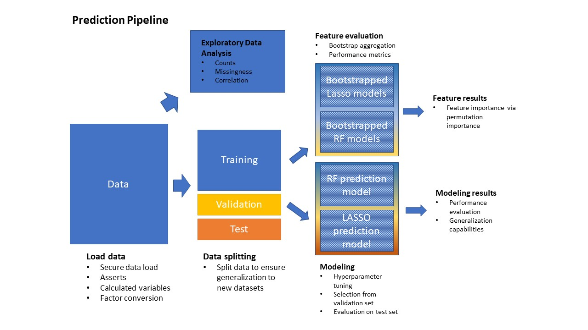

```{r setup, include=FALSE}
knitr::opts_chunk$set(echo = TRUE, warning=FALSE, message=FALSE)
```

## Project run parameters
```{r seeds for reproducibility}
no_tasks=3
seed = 9384
outcome = 'h5mn8'
results_directory = str_c(outcome, '/results_run_2')
set.seed(seed)
```

```{r source files, include=FALSE}
source("function_import.R")
```

**Purpose.** In this work, we will explore the relation between identified measures of despair of interest (e.g., personality measures of self-consciousness, individual and composite item scores from the CES-D assessment) and descriptors of diseases of despair.  We will achieve this goal through modeling the outcomes based on the included predictors, and robustly assess the importance of the included features in predicting the outcomes via bootstrapping.  We will use two well-known machine learning models, random forests and LASSO, which are both frequently used to measure the relative importance of the predictors included in the models.  Lastly, we'll generate trained and tuned models using this reduced feature set which can be used by others wish to predict the identified outcomes.

**Subject inclusion.** For this investigation, we will omit the entirety of Wave 2.  This is commonly done in analyses of AddHealth data due the design of the original study.  Otherwise, our dataset will include only subjects who have predictor and outcome data in _all_ of the waves.

**Outcome variables.** In this experiment, we assess _suicidal ideation_ at Wave 5.  

**Predictor variables.** The predictors for these models are hand-picked, and based on previous work, relevance, and subject matter expertise. The set of predictors and the set of outcomes are disjoint.  Predictors from Waves 1-4 (excluding Wave 2, see above) are included, and will be detailed in the following analysis.

```{r load libraries, include=FALSE}
# Use pacman, which forces an install if the library isn't present on the running machine
if (!require("pacman")) install.packages("pacman")
#pacman::p_install(plotly)
pacman::p_load(tidyverse, h2o, furrr)

```

```{r initializations, include=FALSE}
h2o.init() 
h2o.no_progress()
future::plan(multiprocess)
```

# Pipeline overview
```{r echo=FALSE, out.width='50%'}

```

# Dataset generation

The predictors we will be using will be the the variable `predictor_list` loaded from `10-import-data.Rmd` file. These initial set of predictors will be based of the list of variables that describe anxiety, depression, and optimism.

```{r load raw data}
## set outcome variable of interest
outcome = 'h5mn8'
filebase = '/scratch/p_gaydosh_lab'

wave_data <- load_waves(1:5, filebase=filebase)

full_dataset <- get_working_dataset_full(wave_data, join_type = 'full') 

```


```{r compose working dataset, warning=False, message=False}
## Only study the subjects that we're interested in.
inner_aids <- get_inner(list(wave_data[[1]], wave_data[[3]], wave_data[[4]], wave_data[[5]]))

## get na_levels : dataset to recode all skip levels in variables
na_levels <- read_csv("na_levels.csv")

## use the features and ids that you want to select out what you want
suicide_ds <- full_dataset %>%
  filter(aid %in% inner_aids) %>%
  remove_subjects_not_in_wave1(filebase=filebase) %>%
  add_demographics() %>%
  add_bio_despair(filebase=filebase) %>% 
  dplyr::select(aid, outcome, all_of(c(predictor_list, demographic_age_list, demographic_list))) %>%
  dplyr::select(-c(h5waist,h5bmi,h5dbp,h5bpjcls,h5bpcls4,h5sbp)) %>%
  recode_missing_levels(na_levels)

```

## Outcome variable: Binarizing and recoding details

The following table details the values present in the outcome variable.  As we can see, we need to convert the variable into a factor, and drop the NAs.

```{r warning=FALSE, message=FALSE}
suicide_ds %>% 
  group_by(get(outcome)) %>% 
  summarise(total = n(), type = class(get(outcome)))
```

The table also demonstrates that the classes are very imbalanced, with about 14x the negative class as compared with the positive class.

```{r binarize and drop NA outcome, warning=FALSE, message=FALSE}
suicide_ds <- suicide_ds %>%
  mutate_at(vars(outcome), as.factor) %>%
  drop_na(outcome)
```

After dropping the NAs, we see that we now have 9168 rows, which is consistent with the table above.  The following plot visually displays the class distribution.

```{r warning=FALSE, message=FALSE}
suicide_ds %>% explore_outcome(outcome)
```
The distribution of the data is a distinct imbalance as noted above.  I think this warrants using `pr_auc` as the optimization and selection metric.

# Data exploration and visualization
Here, we comment about the general characteristics of the data based on the provided visualizations.  We comment on missingness of data, any strange or unusual behavior (e.g., strong imbalances), and any correlation that sticks out.

```{r warning=FALSE, message=FALSE}
#Report about the characteristics of the subjects left out of the join
suicide_ds %>% explore_dropped()

```

```{r eda distributions, fig.width = 15, fig.height=15}
# Visualize distributions of variables of interest
suicide_ds %>% 
  dplyr::select(-aid) %>%
  graph_bar_discrete(df = .,
                     plot_title = "Distributions of Discrete Variables",
                     max_categories = 50,
                     num_rows = 3,
                     num_cols = 3,
                     x_axis_size = 12,
                     y_axis_size = 12,
                     title_size = 15)
```

```{r eda missing}
suicide_ds %>%
  graph_missing(only_missing = TRUE,
                title = "Percent Missing",
                box_line_size = .5,
                label_size = .5,
                x_axis_size = 12,
                y_axis_size = 12,
                title_size = 15)

```

```{r eda correlations}
suicide_ds %>%
  #dplyr::select(1:20) %>%
  pairwise_cramers_v() %>%
  plot_cramer_v(x_axis_angle = 90,
                plot_title = "Association among Categorical Variables",
                interactive = TRUE)
```
The correlation plot suggests that there are several variables we might think about removing.  Firstly, there are moderate correlations among the individual predictor blocks; this is due to the way that they are ordered, since they're essentially grouped into subsets.  Addtionally, some predictor pairs have extremely high correlations, like (h4id5j, h4mh26) (correlation of 0.72), and many variables in the h4mh* series.  (h3id5j, h4id5h) also has high correlation > 0.5.  We may want to consider removing several of these in addition to the age variables because it may cause feature importance masking within our approaches.

# Machine learning split of the data

In this section, we split the data to ensure that our model is able to generalize to other datasets.
```{r, message=FALSE, warning=FALSE}
## split the data into relevant proportions desired
data_splits <- suicide_ds %>%
  split_data(strat_var = outcome, ratios=c(0.7, 0.2, 0.1))

# assemble list
training_df <- data_splits$train
validation_df <- data_splits$valid
testing_df <- data_splits$test
```

# Robust feature evaluation {.tabset .tabset-fade .tabset-pills}

The following table displays the mean performance metrics for the bootstrapped models on the validation set, removing values for which there are NA.

```{r save/load rf bootstrap model performance, include=FALSE}

bs_rf_perf = NULL

# get array of files to read
bs_rf_files <- str_c(results_directory, str_c('/bs_rf_perf_', seq(1,no_tasks)), '.csv')

# map read them into a df
bs_rf_perf <- map_dfr(bs_rf_files, read_csv)

```


```{r evaluate bootstrap model performance rf, warning=FALSE, message=FALSE}

mean_bs_rf_perf <- bs_rf_perf %>%
  summarise_if(is.numeric, mean, na.rm=TRUE) %>%
  mutate(model = 'bs_rf') %>%
  dplyr::select(model, everything())

mean_bs_rf_perf
```
As shown, the bootstrapped models tend to have high specificity but low sensitivity, indicating that there is a challenge in identifying subjects with suicidal ideation.

### Feature importances: Random Forest
#### Mean decrease in impurity (MDI)

```{r save/load rf bootstrap model mdi, include=FALSE}

bs_rf_mdi = NULL
  
# get array of files to read
bs_rf_mdi_files <- str_c(results_directory, str_c('/bs_rf_mdi_', seq(1,no_tasks)), '.csv')

# map read them into a df
bs_rf_mdi <- map(bs_rf_mdi_files, read_csv)


```

```{r evaluate bootstrap mdi}
boot_rf_mdi <- bs_rf_mdi %>%
  get_median_placement(use_base_var = TRUE) %>%
  add_attribute_names('predictor', full_dataset) %>%
  dplyr::select(predictor, att_name, overall_rank)

head(boot_rf_mdi, 20)
```
This table returns the MDI variable importance ranks that returned from each of the bootstrapped models.

```{r fig.width = 10, fig.height = 12}
# Needs to be fixed so that axes don't overlap each other and obscure understanding
plot_placement_boxplot(bs_rf_mdi)
```

#### Permutation importance
Now, let's look at the permutation importance:

```{r compute/save or load bs rf model permutation, include=FALSE}

boot_rf_perm_plt = NULL
  
# get array of files to read
boot_rf_perm_files <- str_c(results_directory, str_c('/boot_rf_perm_plt_', seq(1,no_tasks)), '.csv')

# map read them into a df
boot_rf_perm_plt <- map_dfr(boot_rf_perm_files, read_csv)

```


```{r aggregate rf perm results}
met <- 'pr_auc'
boot_rf_perm <- boot_rf_perm_plt %>%
  get_permute_placement(metric_oi=met) %>%
  add_attribute_names('predictor', full_dataset) %>%
  dplyr::select(predictor, everything())

head(boot_rf_perm, 20)
```

#### MDI vs Permutation importance
In this step, we assess the differences generated between the different types of importances.
```{r fig.width = 16, fig.height = 14}
cbind(boot_rf_mdi[1:20,], dplyr::select(boot_rf_perm[1:20,], -all_of(met)))
```
As shown, the MDI importance suffers from imbalances due to the number of values associated with a predictor.  Because the wave ages have so many more values than the other factors, this artificially inflates their importance in MDI.  The permutation importance is more intuitive.

```{r fig.width = 10, fig.height = 12}
plot_permute_var_imp(boot_rf_perm, metric = met)
```


## LASSO model
In this step, we model the relation between the outcomes and the predictors using a linear regression with L2 regularization.  This drives the importance of unimportant and redudant features towards zero.


```{r save/load lasso bootstrap model performance, include=FALSE}

bs_lasso_perf = NULL
  
# get array of files to read
bs_lasso_files <- str_c(results_directory, str_c('/bs_lasso_perf_', seq(1,no_tasks)), '.csv')

# map read them into a df
bs_lasso_perf <- map_dfr(bs_lasso_files, read_csv)


```

```{r evaluate bootstrap model performance lasso, warning=FALSE, message=FALSE}
mean_bs_lasso_perf <- bs_lasso_perf %>%
  summarise_if(is.numeric, mean, na.rm=TRUE) %>% 
  mutate(model='bs_lasso') %>%
  dplyr::select(model, everything())

mean_bs_lasso_perf
```

### Feature importances: LASSO
#### Coefficient-based variable importance

```{r save/load lasso bootstrap model mdi, include=FALSE}

bs_lasso_mdi = NULL
  
# get array of files to read
bs_lasso_mdi_files <- str_c(results_directory, str_c('/bs_lasso_mdi_', seq(1,no_tasks)), '.csv')

# map read them into a df
bs_lasso_mdi <- map(bs_lasso_mdi_files, read_csv)

```

```{r show bs lasso normalized coefficients}
boot_lasso_mdi <- bs_lasso_mdi %>%
  get_median_placement(use_base_var = TRUE) %>%
  add_attribute_names('predictor', full_dataset) %>%
  dplyr::select(predictor, att_name, overall_rank)

head(boot_lasso_mdi, 20)
```

```{r fig.width = 10, fig.height = 12}
plot_placement_boxplot(bs_lasso_mdi)
```

#### Permutation importance

```{r compute/save or load bs lasso model permutation, include=FALSE}

boot_lasso_perm_plt = NULL
  
# get array of files to read
boot_lasso_perm_files <- str_c(results_directory, str_c('/boot_lasso_perm_plt_', seq(1,no_tasks)), '.csv')

# map read them into a df
boot_lasso_perm_plt <- map_dfr(boot_lasso_perm_files, read_csv)

```


```{r aggregate lasso permutations and get metrics}
boot_lasso_perm <- boot_lasso_perm_plt %>%
  get_permute_placement(metric_oi=met) %>% #set in random forest section
  add_attribute_names('predictor', full_dataset) %>%
  dplyr::select(predictor, everything())

head(boot_lasso_perm, 20)
```

```{r plot lasso permutation, fig.width = 10, fig.height = 12}
plot_permute_var_imp(boot_lasso_perm, metric = met)
```

#### Coefficient vs. Permutation importance
Now, we compare the feature importances generated by the two different approaches.  The traditional method of evaluating feature importance for regression methods is through analysis of the coefficients.
```{r fig.width = 16, fig.height = 14}
cbind(boot_lasso_mdi[1:20,], dplyr::select(boot_lasso_perm[1:20,], -met))
```

## Comparison: Model Type Mean Performance
The following table compares the mean performance of bootstrapped random forests to the mean performance of bootstrapped LASSO methods.
```{r compare bs mean performance}
bs_comp_perfs <- rbind(mean_bs_rf_perf, mean_bs_lasso_perf) 
bs_comp_perfs
```

## Comparison: Model Type Feature Importance
Here, we look at the aggregated results of the bootstrapped predictors and compare the models generated to each other.
```{r compre bs feature importance}
joined_results <- boot_rf_perm %>%
  dplyr::select(-met) %>%
  full_join(dplyr::select(boot_lasso_perm, -met), by=c("predictor", "att_name"), suffix=c('.rf', '.lasso')) %>%
  mutate(mean_rank = (overall_rank.rf+overall_rank.lasso)/2) %>%
  arrange(mean_rank)

head(joined_results, 20)
```

The following visualization provides the intuition about the differences in the rankings between model types.  They're ordered by the overall mean importance, and for a given variable, the differences in rank are shown.
```{r bs feature importance plotly, fig.width = 16, fig.height = 14, eval=!from_script}
# Comparison of top_n features
joined_results %>%
  compare_feature_select(interactive = TRUE,
                         top_n = 100,
                         opacity = 0.50,
                         plot_title = "Permutation Importance of Predictors by Model")
```


# Generation of final model {.tabset .tabset-fade .tabset-pills}

## RF model
In this step, we build the final model for the random forest.  We use slightly more values in order to come up with the best model, keeping in mind the number of combinations that are required to run to evaluate the grid.

```{r save/load final rf model}

final_rf_perf = NULL
  
# get array of files to read
final_rf_files <- str_c(results_directory, str_c('/final_rf_perf_', seq(1,no_tasks)), '.csv')

# map read them into a df
final_rf_perfs <- map_dfr(final_rf_files, read_csv)

# get the index of the best performance
final_rfmodel_ind <- which.max(dplyr::select(final_rf_perfs, met) %>% pull(met))

final_rfmodel_dir <- str_c(results_directory, str_c('/final_rf_model_', final_rfmodel_ind, '/'))
final_rfmodel_path <- list.files(final_rfmodel_dir)[[1]]
final_model_rf <- h2o.loadModel(str_c(final_rfmodel_dir, final_rfmodel_path))
final_rf_perf <- final_rf_perfs %>% slice(final_rfmodel_ind)


```

### Performance
The final random forest performance metrics are shown below:
```{r rf final model performance}
# show model final performance
print(final_rf_perf)
```

### Features: permutation importance

```{r compute/save or load final rf model permutation}

final_rf_perm_plt = NULL
  
# get permutation importance of best file
final_rf_perm_file <- str_c(results_directory, str_c('/final_rf_perm_plt_', final_rfmodel_ind), '.csv')

# map read them into a df
final_rf_perm_plt <- read_csv(final_rf_perm_file)

```


```{r get metrics for final rf}
final_rf_perm <- final_rf_perm_plt %>%
  get_permute_placement(metric_oi=met) %>%
  add_attribute_names('predictor', full_dataset) %>%
  dplyr::select(predictor, everything())

head(final_rf_perm, 20)
```

```{r plot rf final permutation, fig.width = 10, fig.height = 12}
plot_permute_var_imp(final_rf_perm, metric = met)
```
### Comparison with bootstrap results
This section investigates the differences in the bootstrap results vs the features generated from the random forest final model.  The following table shows the overall differences in rank.

```{r compare rf final with bootstrap}
rf_joined_results <- final_rf_perm %>%
  dplyr::select(-met) %>%
  full_join(dplyr::select(boot_rf_perm, -met), by=c("predictor", "att_name"), suffix=c('.final', '.bootstrap')) %>%
  mutate(mean_rank = (overall_rank.final + overall_rank.bootstrap)/2) %>%
  arrange(mean_rank)

head(rf_joined_results, 20)
```

The following plot provides visualizations for the difference in the final model rankings vs the bootstrap.

```{r plot final rf features plotly, fig.height=14, fig.width=16}
# Comparison of top_n features
rf_joined_results %>%
  compare_feature_select(sel_cols = c("overall_rank.final", "overall_rank.bootstrap"),
    interactive = TRUE,
    top_n = 100,
    opacity = 0.50,
    plot_title = "Permutation Importance of Predictors: Final vs. Bootstrap")
```

## LASSO model
Now, we create the final model for LASSO.  There is no substantial difference between this method and the bootstrap methods, other than the data upon which the model is being built.

```{r save/load final lasso model}

final_lasso_perf = NULL
  
# get array of files to read
final_lasso_files <- str_c(results_directory, str_c('/final_lasso_perf_', seq(1,no_tasks)), '.csv')

# map read them into a df
final_lasso_perfs <- map_dfr(final_lasso_files, read_csv)

# get the index of the best performance
final_lassomodel_ind <- which.max(dplyr::select(final_lasso_perfs, met) %>% pull(met))

final_lassomodel_dir <- str_c(results_directory, str_c('/final_lasso_model_', final_lassomodel_ind, '/'))
final_lassomodel_path <- list.files(final_lassomodel_dir)[[1]]
final_model_lasso <- h2o.loadModel(str_c(final_lassomodel_dir, final_lassomodel_path))
final_lasso_perf <- final_lasso_perfs %>% slice(final_lassomodel_ind)

```

The final LASSO performance metrics are shown below:
```{r lasso final model performance}
# show model final performance
print(final_lasso_perf)
```

### Features: permutation importance

```{r compute/save or load final lasso model permutation}

final_lasso_perm_plt = NULL
  
# get permutation importance of best file
final_lasso_perm_file <- str_c(results_directory, str_c('/final_lasso_perm_plt_', final_lassomodel_ind), '.csv')

# map read them into a df
final_lasso_perm_plt <- read_csv(final_lasso_perm_file)


```

```{r get permute features for final lasso}
final_lasso_perm <- final_lasso_perm_plt %>%
  get_permute_placement(metric_oi=met) %>%
  add_attribute_names('predictor', full_dataset) %>%
  dplyr::select(predictor, everything())

head(final_lasso_perm, 20)
```

```{r plot lasso final permutation, fig.width = 10, fig.height = 12}
plot_permute_var_imp(final_lasso_perm, metric = met)
```
### Comparison with bootstrap results
This section investigates the differences in the bootstrap results vs the features generated from the LASSO final model.  The following table shows the overall differences in rank.

```{r compare lasso final with bootstrap}
lasso_joined_results <- final_lasso_perm %>%
  dplyr::select(-met) %>%
  full_join(dplyr::select(boot_lasso_perm, -met), by=c("predictor", "att_name"), suffix=c('.final', '.bootstrap')) %>%
  mutate(mean_rank = (overall_rank.final + overall_rank.bootstrap)/2) %>%
  arrange(mean_rank)

head(lasso_joined_results, 20)
```

The following plot provides visualizations for the difference in the final model rankings vs the bootstrap.

```{r plot lasso feature comparison, fig.width = 16, fig.height = 14}
# Comparison of top_n features
lasso_joined_results %>%
  compare_feature_select(sel_cols = c("overall_rank.final", "overall_rank.bootstrap"),
    interactive = TRUE,
    top_n = 100,
    opacity = 0.50,
    plot_title = "Permutation Importance of Predictors: Final vs. Bootstrap")
```

## Comparison: Final model features
Here, we compare the features generated by the permutation importance between the two final models.

```{r compare lasso vs random forest features final}
rf_lasso_final_joined_results <- final_rf_perm %>%
  dplyr::select(-met) %>%
  full_join(dplyr::select(final_lasso_perm, -met), by=c("predictor", "att_name"), suffix=c('.rf', '.lasso')) %>%
  mutate(mean_rank = (overall_rank.rf+overall_rank.lasso)/2) %>%
  arrange(mean_rank)

head(rf_lasso_final_joined_results, 20)
```

The following visualization provides the intuition about the differences in the rankings between the final model types.  They're ordered by the overall mean importance, and for a given variable, the differences in rank are shown.

```{r plotly lasso v random forest features}
# Comparison of top_n features
rf_lasso_final_joined_results %>%
  compare_feature_select(sel_cols = c("overall_rank.rf", "overall_rank.lasso"),
    interactive = TRUE,
    top_n = 100,
    opacity = 0.50,
    plot_title = "Permutation Importance of Predictors: Random Forest vs Lasso")
```

## Comparison: Final model performance
With the final models generated, we're now able to compare their performance metrics.
```{r final model comparison, fig.width = 10, fig.height = 12}
# Comparison of performance metrics
valid_perf <- get_metric_set_from_perfs(perf_list = list(final_rf_perf, final_lasso_perf)) %>%
  mutate(model = c('rf', 'lasso'))

testing_perf <- get_metric_set_from_models(testing_df, list(final_model_rf, final_model_lasso), out=outcome) %>%
  mutate(model = c('rf', 'lasso'))
```

**Validation and selection.**
The following table shows the comparison between models in terms of the validation set.  We can select our final model based on the best performing model according to the metric.
```{r}
print(valid_perf)
```

**Testing performance.**
The following shows the performance of both the models on the test set.  Note that although we don't use this test set to evaluate the final models, we can still see how our selected method would have performed.
```{r}
print(testing_perf)
```

The following plots show a comparison between the performance of the models on the validation and test sets.  Again, we don't choose the model based on the test set, but curiosity dictates that we view this performance.

```{r fig.width = 10, fig.height = 6}
# Show plots side by side
metrics_of_interest = c('model', 'accuracy', 'bal_accuracy', 'mpce', 'sens', 'spec', 'ppv', 'npv', 'pr_auc', 'roc_auc')
valid_plt <- plot_metric_set(dplyr::select(valid_perf, all_of(metrics_of_interest)), plot_title = "Model comparison for validation set")
test_plt <- plot_metric_set(dplyr::select(testing_perf, all_of(metrics_of_interest)), plot_title = "Model comparison for testing set")
gridExtra::grid.arrange(gridExtra::arrangeGrob(valid_plt, test_plt, ncol=2, nrow=1))
```

